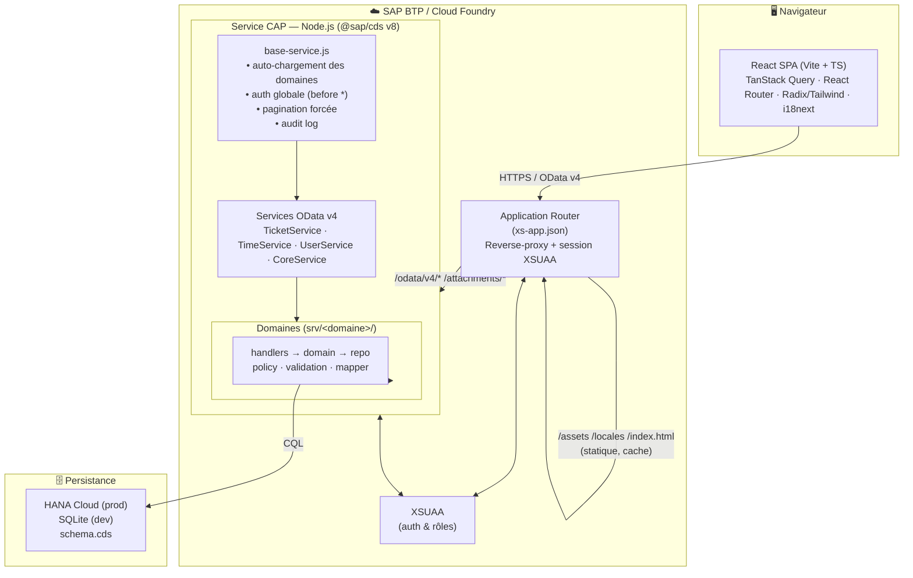
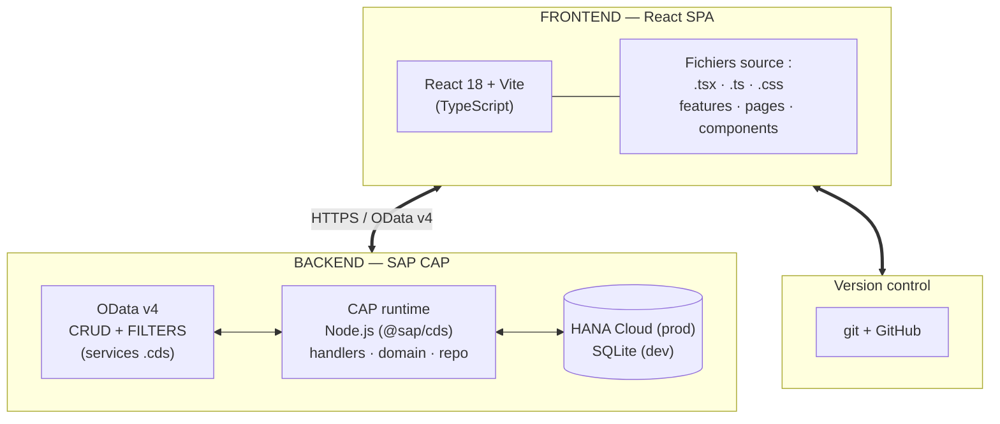

# Architecture globale — Ticket-CAP

Plateforme de gestion de tickets / performance basée sur **SAP CAP (OData v4)** + **React SPA**,
déployable sur **SAP BTP / Cloud Foundry** via un **Application Router** sécurisé par XSUAA.

---

## 1. Schéma global (Mermaid)



---

## 1bis. Architecture en couches (Frontend / Backend / BD / Déploiement BTP)



---

## 2. Schéma global (ASCII)

```
                          ┌──────────────────────────────────────────┐
                          │              NAVIGATEUR                    │
                          │  React SPA (Vite + TypeScript)             │
                          │  TanStack Query · React Router 7           │
                          │  Radix UI + Tailwind · react-hook-form     │
                          │  i18next (FR/EN) · recharts                │
                          └─────────────────────┬────────────────────┘
                                                │ HTTPS / OData v4
                                                ▼
        ┌────────────────────────────────────────────────────────────────────┐
        │                  APPLICATION ROUTER (xs-app.json)                    │
        │  • /odata/v4/*  /attachments/*  → srv-api (auth XSUAA)               │
        │  • /assets /locales /*.png...   → statique local (cache, no auth)    │
        │  • /index.html  /*              → SPA fallback (auth XSUAA)          │
        └───────────────┬───────────────────────────────────┬────────────────┘
                        │                                    │ session
                        ▼                                    ▼
   ┌─────────────────────────────────────────┐      ┌──────────────────┐
   │        SERVICE CAP — Node.js             │◄────►│      XSUAA       │
   │           (@sap/cds v8)                  │      │  auth & rôles    │
   │                                          │      └──────────────────┘
   │  base-service.js  (socle transversal)    │
   │   ├─ auto-chargement des *.impl.js        │
   │   ├─ auth globale     srv.before('*')     │
   │   ├─ pagination ($top ≤ 500, défaut 100)  │
   │   └─ audit log                            │
   │                                          │
   │  Services OData v4                        │
   │   TicketService · TimeService            │
   │   UserService   · CoreService            │
   │                                          │
   │  Domaines  srv/<domaine>/  (par couche)  │
   │  ┌────────────────────────────────────┐  │
   │  │ *.service.cds   définition OData    │  │
   │  │ *.handlers.js   hooks before/on/after│ │
   │  │ *.domain.js     logique métier      │  │
   │  │ *.repo.js       accès données (CQL) │  │
   │  │ *.policy.js     autorisations       │  │
   │  │ *.validation.js validation entrées  │  │
   │  │ *.mapper.js     DTO ↔ entités       │  │
   │  └────────────────────────────────────┘  │
   └─────────────────────┬────────────────────┘
                         │ CQL
                         ▼
        ┌────────────────────────────────────────────┐
        │              PERSISTANCE                     │
        │  db/schema.cds  (sap.performance.dashboard)  │
        │  ┌────────────────────────────────────────┐  │
        │  │ HANA Cloud   → production               │  │
        │  │ SQLite       → développement local      │  │
        │  └────────────────────────────────────────┘  │
        │  Entités : Users · Tickets · Projects ·      │
        │  Wricef · Imputations · LeaveRequests · ...  │
        └──────────────────────────────────────────────┘
```

---

## 3. Détail Frontend (organisation interne)

```
app/frontend/src/app/
├── App.tsx · routes.tsx              Bootstrap + définition des routes
├── context/                          AuthContext · ThemeContext · DensityContext · roleRouting
├── services/odata/                   1 client API typé par entité (ticketsApi, usersApi, ...)
├── features/                         Modules métier (feature-first)
│   └── tickets/  ── api · hooks · model · components/ · pages/
├── pages/                            Pages segmentées PAR RÔLE
│   ├── admin/ · manager/ · project-manager/
│   ├── consultant-tech/ · consultant-func/ · dev-coordinator/
│   └── shared/ · Login.page.tsx
├── components/                       business · charts · common · layout · ui
├── routing/routeRegistry.ts          Registre central des routes
├── locales/ (fr, en) · styles/ · types/ · utils/
```

---

## 4. Pipeline de build

```
npm run build
  └─ build:web        → Vite build du frontend
  └─ sync:approuter   → copie des assets vers approuter/resources
  └─ cds build --production
```

---

## 5. Rôles applicatifs

`ADMIN` · `MANAGER` · `PROJECT_MANAGER` · `DEV_COORDINATOR` ·
`CONSULTANT_TECHNIQUE` · `CONSULTANT_FONCTIONNEL`

Le routage des pages (frontend) et les `*.policy.js` (backend) appliquent les autorisations selon ces rôles.
```
